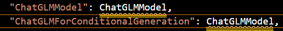
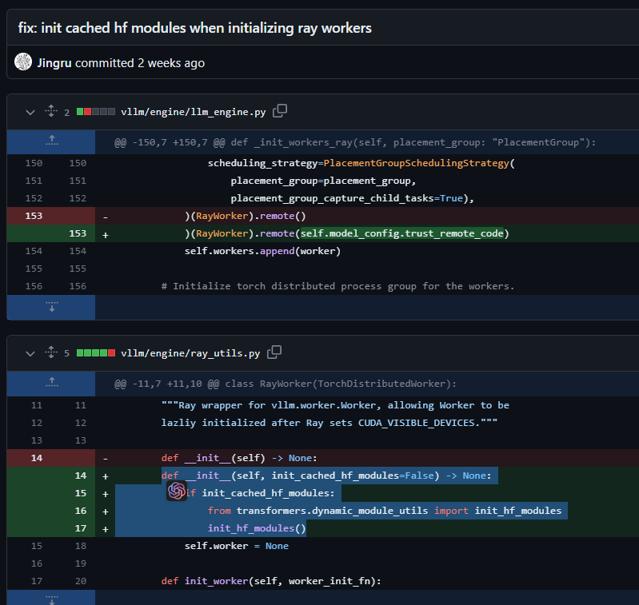

# LogReader
LogReader: Leveraging Large Language Models for General-Purpose Log Analysis

## Run Environment 
### Train
```shell
conda create -n xtuner python=3.11.4
pip install xtuner
# deepspeed support
pip install deepspeed
conda install mpi4py-mpich
```
### Inference
```shell
pip install --upgrade ray
pip install --upgrade pyarrow
pip install pandas
pip install vllm
pip install ray
```
#### ChatGLM2 support

- Modify the source code according to the commit below. Only single card is supported. <a> https://github.com/vllm-project/vllm/pull/649 </a>
- Models after SFT need to be added to the following file.
<a> ~/miniconda3/envs/llm_eval/lib/python3.11/site-packages/vllm/model_executor/model_loader.py </a>


If occur error like:
```
"tansformers_module" ModuleNotFoundError when load model with trust_remote_code=True
```
Distributed support requires changing the following code:


## Train step
```shell
export NPROC_PER_NODE=4
nohup xtuner train train/llama2_7b_qlora_logQA.py >tunning_llama2-chat-7b.log 2>&1 &
nohup xtuner train train/qwen_7b_qlora_ad.py --work-dir /mnt/qjx/qwen_chat_7b_qlora_ad  > tunning_qwen-chat-7b.log 2>&1 &
# Merge LoRA adapter
xtuner convert merge_adapter ../../train/baichuan_7b_qlora_logQA.py  ./epoch_20.pth  ./baichuan-chat-7b-ft_log_20.pth --max-shard-size 5GB
```
# Inference 
```python
python inference/demo.py
```
